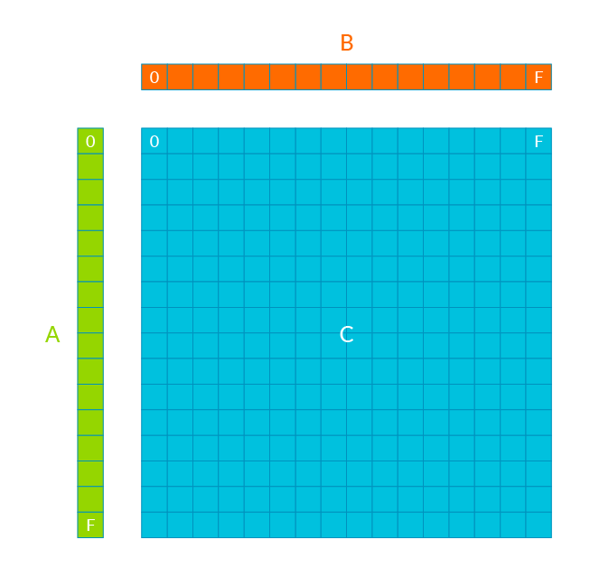

### Scalable Matrix Extension (SME)

The Scalable Matrix Extension (SME) defines architectural state capable of holding two-dimensional matrix tiles, and a Streaming SVE mode which supports execution of SVE2 instructions with a vector length that matches the tile width, along with instructions that accumulate the outer product of two vectors into a tile, as well as load, store, and move instructions that transfer a vector to or from a tile row or column. The extension also defines System registers and fields that identify the presence and capabilities of SME, and enable and control its behavior at each Exception level[1](https://developer.arm.com/documentation/ddi0616/latest). 

SME is built on the Scalable Vector Extensions (SVE and SVE2), adding new capabilities to efficiently process matrices. Key features include: Matrix tile storage; Load, store, insert, and extract tile vectors, including on-the-fly transposition; Outer product of SVE vectors; Streaming SVE mode; Matrix multiplication on Arm[2](https://community.arm.com/arm-community-blogs/b/architectures-and-processors-blog/posts/scalable-matrix-extension-armv9-a-architecture).

SME is based on an outer-product engine, which takes the idea of generating multiple results per load further still:

The outer-product of given two vectors of size $m \times 1$ $u$ and $n \times 1$ $v$:

$(u \otimes v)_{ij} = u_iv_j$

### Reference

1. [ARM SME documentation](https://developer.arm.com/documentation/ddi0616/latest)

2. [Introducing the Scalable Matrix Extension for the Armv9-A Architecture](https://community.arm.com/arm-community-blogs/b/architectures-and-processors-blog/posts/scalable-matrix-extension-armv9-a-architecture)